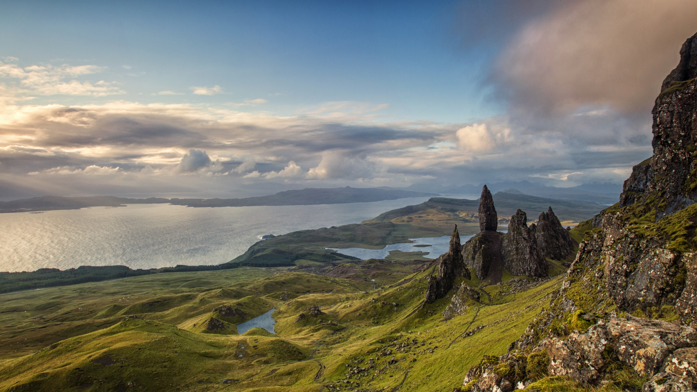
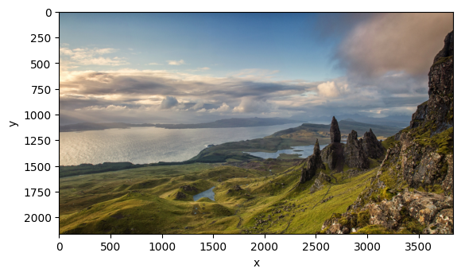

# Image Analysis and Processing Report

**Date:** November, 2023  

## 📌 Project Description
This project focuses on processing a scenic landscape image using Python in a Jupyter Notebook. Original and processed images are displayed and analyzed within the notebook, showcasing basic image transformations and enhancements for visual improvement.

## 🌄 Original Image
The original landscape image used for processing is shown below:

## 🛠️ Processed Image
After applying image processing techniques, the modified result is:

## 🧪 Methodology
The image was analyzed and processed using the following steps in the `Matrix.ipynb` notebook:

- Loading the original image
- Applying image transformations (e.g., resizing, cropping, filtering)
- Displaying processed output using `matplotlib`
- Saving results for documentation

Libraries used may include:
- `numpy`
- `matplotlib`
- `opencv-python`

## ✅ Conclusion
The project demonstrates simple but effective image processing using Python. The resulting visuals show how code can enhance and transform digital media. Future work could explore advanced techniques such as edge detection, segmentation, or machine learning-based image analysis.
